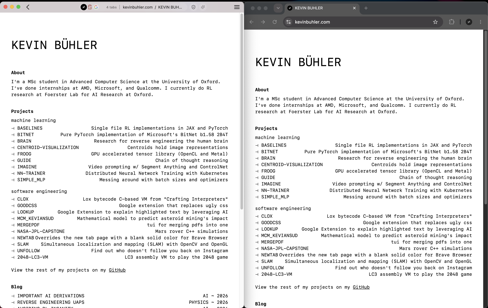
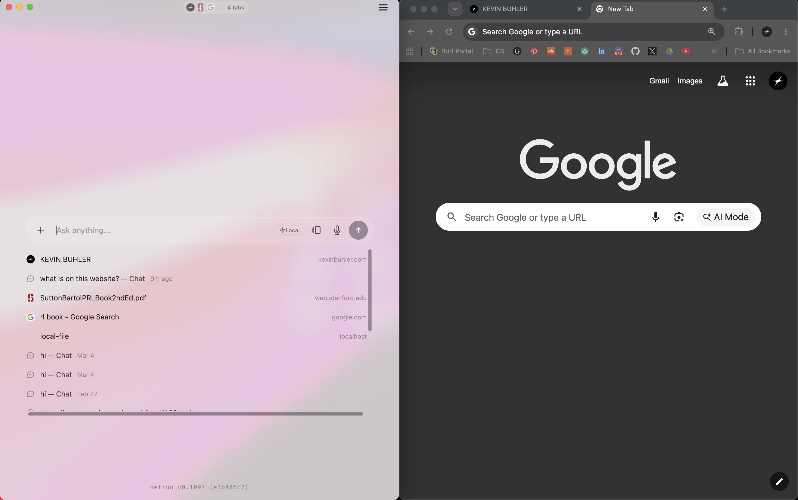
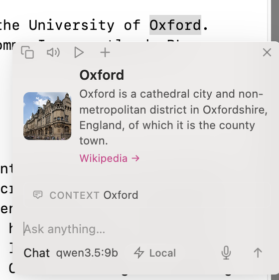
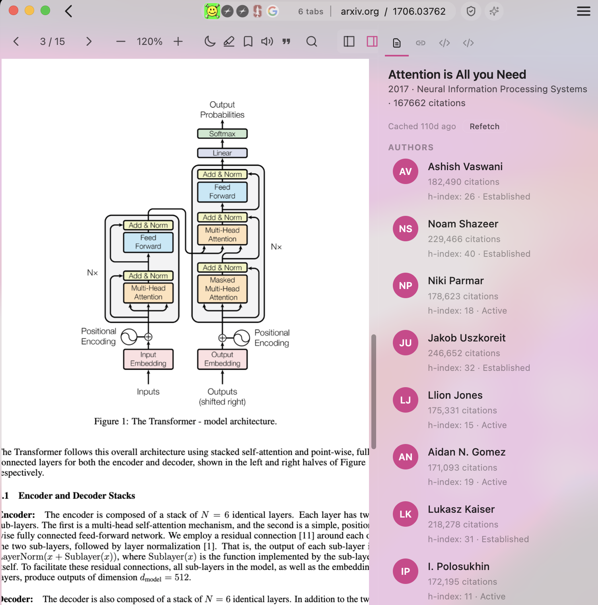
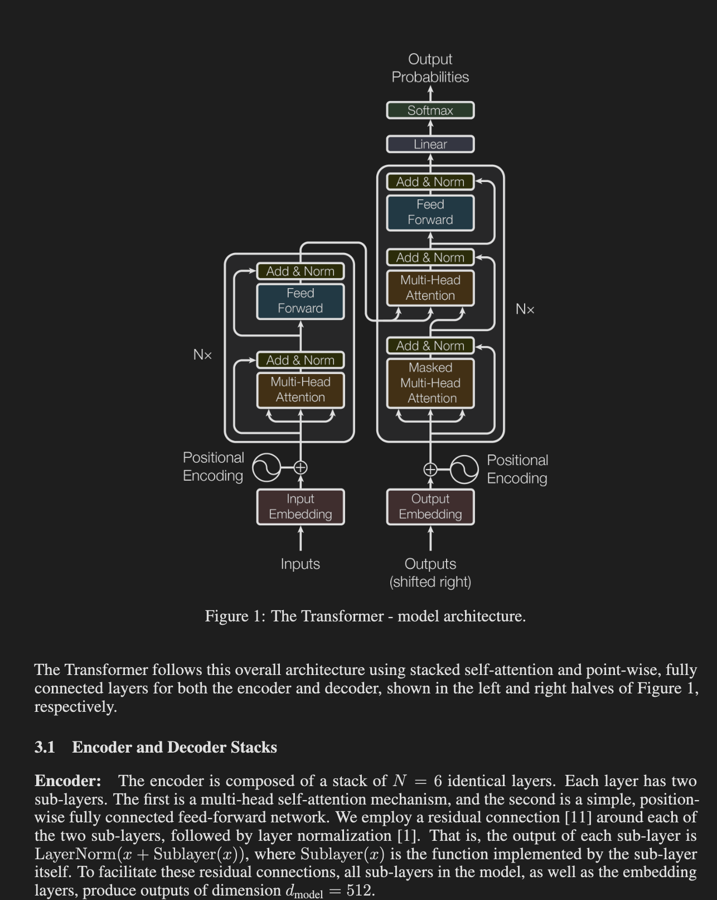
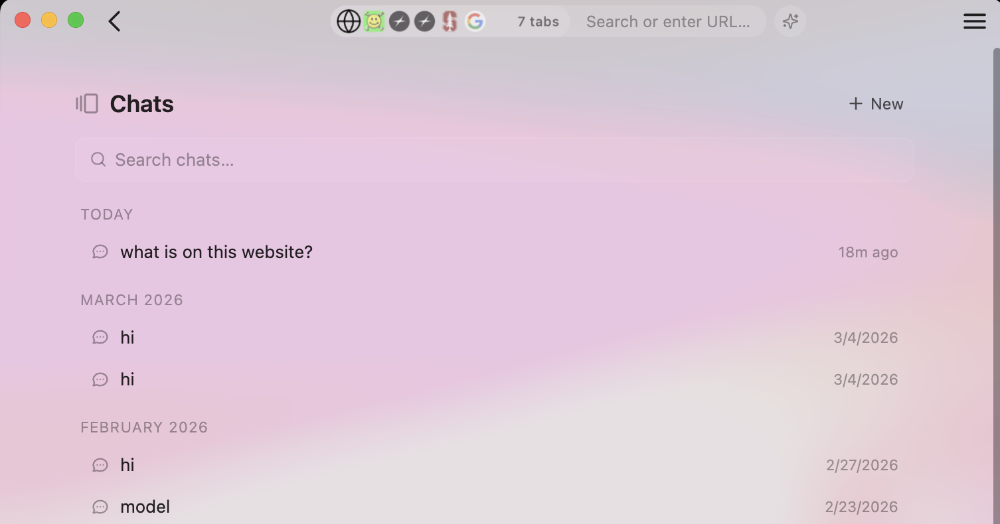

<p align="center">
  
</p>

# NETRUN

privacy-focused AI-native smart browser that i worked on all day for 38 straight days.

## Gallery

<table>
  <tr>
    <td colspan="3"></td>
  </tr>
  <tr>
    <td colspan="3" align="center"><em>left: netrun, right: chrome. notice how much space is saved at the top but you haven't lost any functionality</em></td>
  </tr>
  <tr>
    <td width="50%"></td>
    <td width="50%"></td>
  </tr>
  <tr>
    <td align="center"><em>left: netrun, right: chrome. home page is way cleaner than chrome and is built around the search bar</em></td>
    <td align="center"><em>i love this panel: right clicking (e.g. on the word "oxford here") brings up an interactive ai panel that follows your mouse. no side panels. its extremely useful and i'm surprised no-one else has done it.</em></td>
  </tr>
  <tr>
    <td width="33%"></td>
    <td width="33%"></td>
    <td width="33%"></td>
  </tr>
  <tr>
    <td align="center"><em>custom PDF reader that automatically brings up references and metadata about your research papers</em></td>
    <td align="center"><em>dark mode papers</em></td>
    <td align="center"><em>all chats routed to one place</em></td>
  </tr>
</table>

## Features

- brain-rot warnings
- feels alive since i incorporated dynamic island 
- right-click to get ai panel anywhere
- neuralook: ai model that allows you to move the mouse just by looking at the screen
- cleaner than apple
- convincing ai voice that read pages aloud and highlights the words being spoken
- max privacy (HTTPS-only, tracker/cookie blocking, DoH, WebRTC leak guard)
- youtube ad blocking (uses brave's blocker so it works great)
- browser agents (local Ollama or cloud OpenRouter)
- buttery custom paper reader and researcher mode
- personalized recommendation engine
- analyzes page and warns you about scams or over-exaggerations

## Install & Run

```bash
./setup.sh      # install dependencies (macOS, one time)
npm start       # launch the app
```